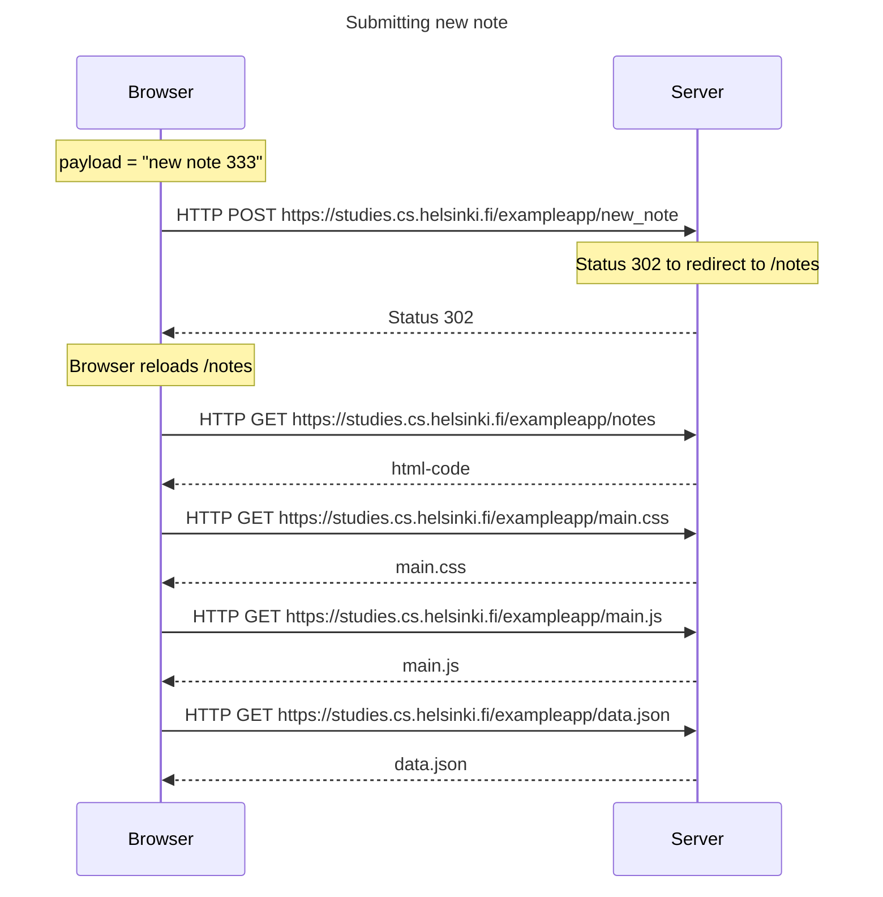

```mermaid

sequenceDiagram
title Submitting new note

participant Browser
participant Server

note over Browser: payload = "new note 333"

Browser->> Server: HTTP POST https://studies.cs.helsinki.fi/exampleapp/new_note

note over Server: Status 302 to redirect to /notes

Server -->> Browser: Status 302

note over Browser: Browser reloads /notes
Browser ->> Server : HTTP GET https://studies.cs.helsinki.fi/exampleapp/notes

Server -->> Browser: html-code

Browser ->> Server: HTTP GET https://studies.cs.helsinki.fi/exampleapp/main.css

Server -->> Browser: main.css

Browser ->> Server: HTTP GET https://studies.cs.helsinki.fi/exampleapp/main.js

Server -->> Browser: main.js

Browser ->> Server: HTTP GET https://studies.cs.helsinki.fi/exampleapp/data.json

Server -->> Browser: data.json

```
